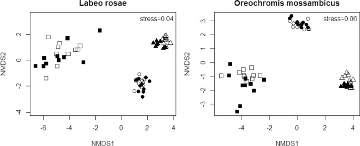
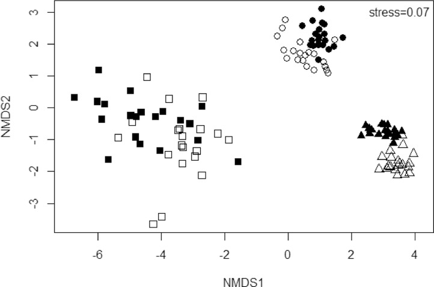

# ICP-OES

## :thought_balloon: Background 
Scientists from  University of KwaZulu-Natal conducted an array of ICP-OES analysis experiments to assess contamination in the Flag Boshielo Dam. They found that when a body of water is introduced to metal contamination it is retained by the various organisms, and the bottom sediment rather than remaining suspended in the water. Non-metric multidimensional scaling ordination was performed on the metal(loid) concentrations within the gill, liver, and muscle of two fish species during two different seasons. Cluster analysis show little difference between metal concentration within the fish between winter and summer[fig 1.] while showing statistically notable difference between species.  

 

*Lebepe J, Oberholster PJ, Luus-Powell WJ. Dataset of metal(loid) concentrations recorded in the tissues of two fish species from Flag Boshielo Dam, South Africa. Data Brief. 2020;33:106396. Published 2020 Oct 9. doi:10.1016/j.dib.2020.106396*