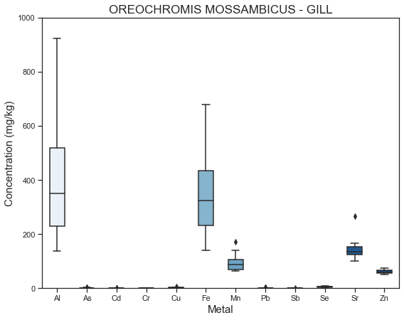
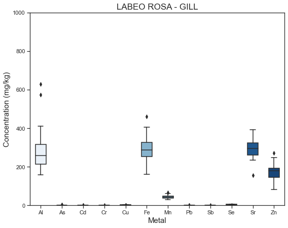
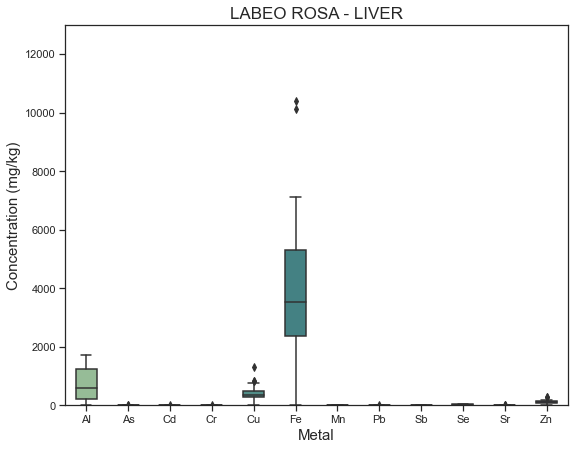

#  Metal Contamination in the Flag Boshielo Dam

 

## Background 
Scientists from  University of KwaZulu-Natal conducted an array of ICP-OES experiments to assess contamination in the Flag Boshielo Dam. They found that when a body of water is introduced to metal contamination it is retained by the various organisms and bottom sediment rather than remaining suspended in the water. They then performed non-metric multidimensional scaling ordination  on the metal(loid) concentrations within the gill, liver, and muscle of two fish species during two different seasons. The resulting clusters showed little difference in metal concentration within the fish when the seasons varied between winter and summer **[Fig 1.]** but showing statistically notable differences between the two species upon analysis of the gills and muscles **[Fig 2.]**.     

**Fig. 1** Liver (square), Gill (circle) and Muscle (triangle). Summer (unfilled) and Winter (filled). 2014. 
 
 

**Fig. 2** Liver (square), Gill (circle) and Muscle (triangle) of Labeo rosae (filled) and Oreochromis mossambicus (unfilled).
 
 

##  Instrumentation 
Perkin Elmer, Optima 2100 DV [Detection limit: 0.01 mg/L]
 

##  Visualization
A supplementary XLS file with data pertaining to the fish specimens' morphometry and the concentrations of metal(loid)s were provided by The National Center for Biotechnology Information and the scientists from University of KwaZulu-Natal. This is an exploratory analysis of that data. The original files were converted to CSV format and titled fish_tissues.csv' and 'fish_morphometry.csv'. The code behind the  visualizations below can be found in the Jupyter notebook titled "Data Visualization.ipynb".  

##  Python Libraries
* NumPy
* Matplotlib
* Seaborn

##  References

**1.**   Lebepe J, Oberholster PJ, Luus-Powell WJ. Dataset of metal(loid) concentrations recorded in the tissues of two fish species from Flag Boshielo Dam, South Africa. Data Brief. 2020;33:106396. Published 2020 Oct 9. doi:10.1016/j.dib.2020.106396

